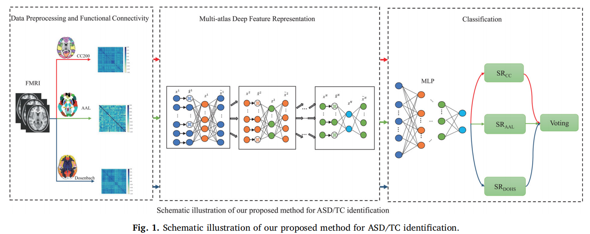

### 论文名称 - AIMAFE: Autism spectrum disorder identification with multi-atlas deep feature representation and ensemble learning

#### 环境配置

1. Python 3.7.4
2. Pyotrch 1.5

#### 运行
1. 下载三个图谱的数据（npy后缀）放在data文件夹里面 https://github.com/yutian-newbie/GNN-for-different-fields/releases/tag/ABIDE-Data
2. 分别设置main_VAE中atlas变量为cc200, aal, dosenbach160
2. 运行三次main_VAE.py
4. 运行Vote.py进行三个图谱的投票

#### 模型概述

1. 去功能连接的上三角拉平作为特征向量（data里提供了处理过后的特征）
2. 使用变分自编码器编码隐变量，使用KL散度和MSELoss监督特征重建
3. 使用MLP对隐变量进行分类
4. 对三个图谱的结果进行硬投票

#### 文章引用

Wang, Y., Wang, J., Wu, F. X., Hayrat, R., & Liu, J. (2020). AIMAFE: autism spectrum disorder identification with multi-atlas deep feature representation and ensemble learning. Journal of Neuroscience Methods, 343, 108840.

#### 其他

1. 原始代码使用的是Python-2.7以及tensorflow-0.1,感兴趣的可以参考论文中的Github连接
