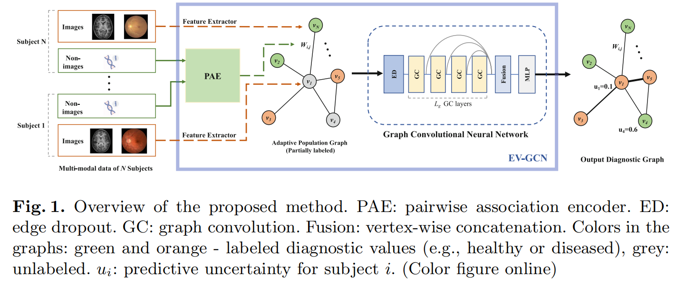

### 论文名称 - Edge-variational Graph Convolutional Networks for Uncertainty-aware Disease Prediction

#### 环境配置

1. Python 3.7
2. Pyotrch 1.4
3. torch-geometric (有点麻烦建议百度)  

安装torch-geometric之前安装pytorch

#### 运行

1. 使用 fetch_data.py 下载 ABIDE-871 的数据集
2. 运行  train_eval_evgcn.py

#### 模型概述

1. 使用REF(递归特征消除)进行特征选择
2. 使用功能链接数据利用高斯核生成相似距离邻接矩阵
3. 使用性别，站点等表型信息构造人口学联通矩阵
4. 以上两个矩阵相乘合并为一个矩阵， 根据阈值筛选部分边
5. 把边两边的节点的表型信息拼接，通过全连接层映射（PAE），再通过cos相似度来自适应构图
6. 通过4层3阶切比雪夫图卷积网络，每层输出结果拼接
7. MLP对拼接结果进行分类

PS:引入了Edge Dropout机制(训练时随机丢弃部分边，缓解过拟合)

#### 其他

**该文章发在 MICCAI 2020**

Huang, Y., & Chung, A. (2020, October). Edge-variational graph convolutional networks for uncertainty-aware disease prediction. In International Conference on Medical Image Computing and Computer-Assisted Intervention (pp. 562-572). Springer, Cham.

**转投期刊**

暂未找
