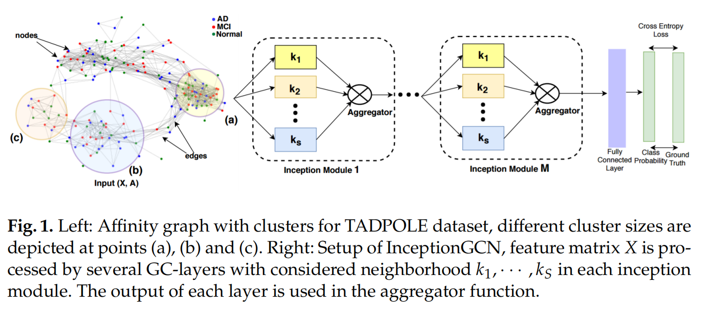

### 论文名称 - InceptionGCN: receptive field aware graph convolutional network for disease prediction.

#### 环境配置

1. tensorflow1.15
2. 其他看需安装

环境同Population-GCN

#### 运行

1. 和Population-GCN的ABIDE数据一样
2. 运行  train_eval_evgcn.py

#### 模型概述

1. 在Population-GCN 的基础上探究了不同阶数切比雪夫图卷积层的影响
2. 文章认为不同阶数的切比雪夫图卷积的感受野不同，所以卷积的得到的图可称为异构图

PS:在ABIDE上未成功复现出结果

#### 其他

**该文章发在 IPMI 2019**

Kazi, A., Shekarforoush, S., Arvind Krishna, S., Burwinkel, H., Vivar, G., Kortüm, K., ... & Navab, N. (2019, June). InceptionGCN: receptive field aware graph convolutional network for disease prediction. In International Conference on Information Processing in Medical Imaging (pp. 73-85). Springer, Cham.

**转投期刊**
