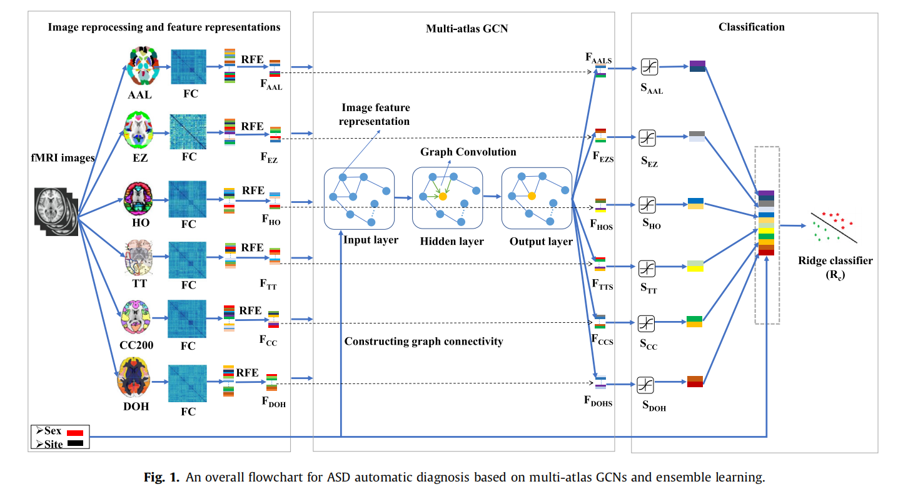

### 论文名称 - MAGE: Automatic diagnosis of autism spectrum disorders using multi-atlas graph convolutional networks and ensemble learning.

#### 环境配置

1. tensorflow环境老版本tf1.15
2. GCN tensorflow版本  链接： [forked GCN project](https://github.com/parisots/gcn).  

#### 运行

1. 运行main_ABIDE.py
2. main_ABIDE.py 中使用的MLP_feature为6个图谱输出的特征加人口学特征。

#### 模型概述

1. 使用REF(递归特征消除)进行特征选择
2. 使用功能链接数据利用高斯核生成相似距离邻接矩阵
3. 使用性别，站点等表型信息构造人口学联通矩阵
4. 不同图谱通过GCN生成一组预测分数
5. 6组图谱数据加上性别，站点拼接成14维特征
5. 用岭回归分类

#### 参考文献

Wang, Y., Liu, J., Xiang, Y., Wang, J., Chen, Q., & Chong, J. (2022). MAGE: automatic diagnosis of autism spectrum disorders using multi-atlas graph convolutional networks and ensemble learning. Neurocomputing, 469, 346-353.

#### 其他
