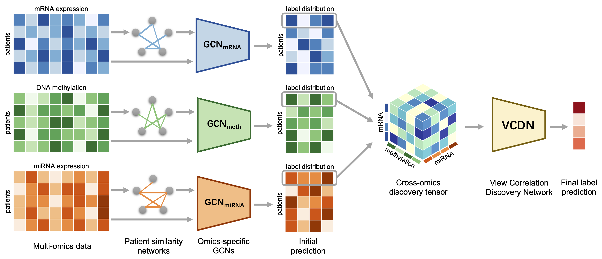

### 论文名称 - MOGONET integrates multi-omics data using graph convolutional networks allowing patient classification and biomarker identification

#### 环境配置

1. Python 3.6
2. Pyotrch 1.4 以上
3. 其他按需配置

#### 运行

1. 无

#### 模型概述

1. 三种特征通过不共享的图卷积层进行分类，得到标签预测分数
2. 三种标签预测分数通过变换变成一个三维特征
3. 通过 VCDN 对标签预测分数进行决策融合

#### 文章引用

**文章发在 NC 2021**

Wang, T., Shao, W., Huang, Z., Tang, H., Zhang, J., Ding, Z., & Huang, K. (2021). MOGONET integrates multi-omics data using graph convolutional networks allowing patient classification and biomarker identification. Nature Communications, 12(1), 1-13.

**转投**

#### 其他

由于本篇文章没有复现，简单描述一下
