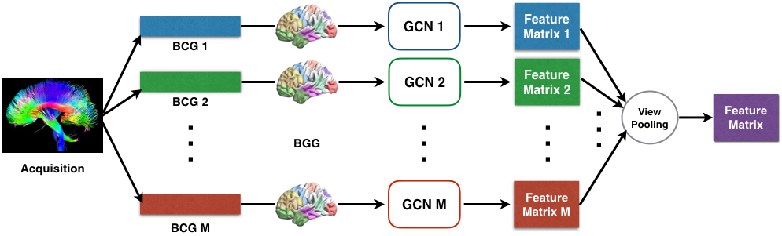

### 论文名称 - Multi-View Graph Convolutional Network and Its Applications on Neuroimage Analysis for Parkinson’s Disease

#### 环境配置

#### 运行

#### 模型概述

#### 文章引用

**该文章发在 AMIA 2018**

Zhang, X., He, L., Chen, K., Luo, Y., Zhou, J., & Wang, F. (2018). Multi-view graph convolutional network and its applications on neuroimage analysis for parkinson’s disease. In AMIA Annual Symposium Proceedings (Vol. 2018, p. 1147). American Medical Informatics Association.

**转投**

#### 其他
