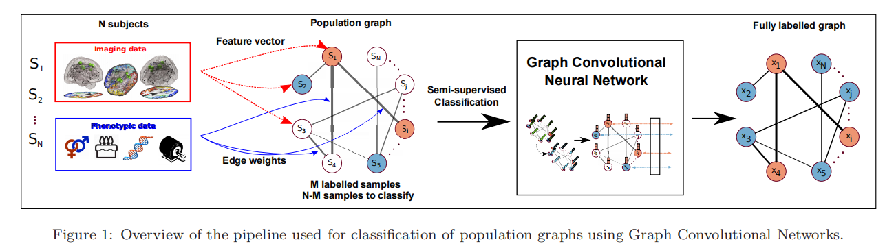

### 论文名称 - Spectral Graph Convolutions for Population-based Disease Prediction.

#### 环境配置

1. tensorflow环境老版本tf1.15
2. GCN tensorflow版本  链接： [forked GCN project](https://github.com/parisots/gcn).  

#### 运行

1. 使用 fetch_data.py 下载 ABIDE-871 的数据集
2. run

#### 模型概述

1. 使用REF(递归特征消除)进行特征选择
2. 使用功能链接数据利用高斯核生成相似距离邻接矩阵
3. 使用性别，站点等表型信息构造人口学联通矩阵
4. 以上两个矩阵相乘作为GCN的输入矩阵
5. 使用三阶切比雪夫图卷积进行节点分类

#### 其他

**该文章发在 MICCAI 2017**

Parisot, S., Ktena, S. I., Ferrante, E., Lee, M., Moreno, R. G., Glocker, B., & Rueckert, D. (2017).Spectral Graph Convolutions for Population-based Disease Prediction.MICCAI 2017.

**转载MIA 2017**

Parisot, S., Ktena, S. I., Ferrante, E., Lee, M., Moreno, R. G., Glocker, B., & Rueckert, D. (2017).Disease Prediction using Graph Convolutional Networks: Application to Autism Spectrum Disorder and Alzheimer’s Disease.Medical Image Analysis, 2018.
