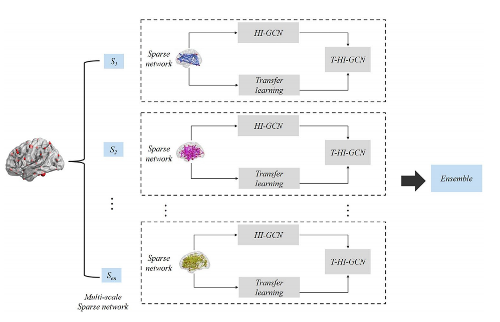

### 论文名称 - TE-HI-GCN: An Ensemble of Transfer Hierarchical Graph Convolutional Networks for Disorder Diagnosis

#### 环境配置

1. Python 3.6
2. Pyotrch

#### 运行

1. 创建文件夹 model
2. 进入model文件夹，创建fGCN/hiGCN/ehiGCN
3. 分别进入以上三个文件夹
4. 运行对应代码 train-fGCN.py;train-hiGCN.py;train-ehiGCN.py

#### 模型概述

1. 先训练fCGN,根据阈值不同会生成不同的模型
2. 在生成的fGCN基础上训练HI-GCN, 模型保存
3. 在T-HI-GCN, 把不同阈值状态下的HI-GCN读取并进行决策融合（直接相加）

#### 文章引用

**该文章发在 Neuroinformatics 2021**

Li, L., Jiang, H., Wen, G., Cao, P., Xu, M., Liu, X., ... & Zaiane, O. (2021). TE-HI-GCN: An Ensemble of Transfer Hierarchical Graph Convolutional Networks for Disorder Diagnosis. Neuroinformatics, 1-23.

**转投**

#### 其他

1. 模型好像不是端到端的，得先训练保存前两个模型，在进行集成学习
2. 迁移学习部分好像未在代码中体现
